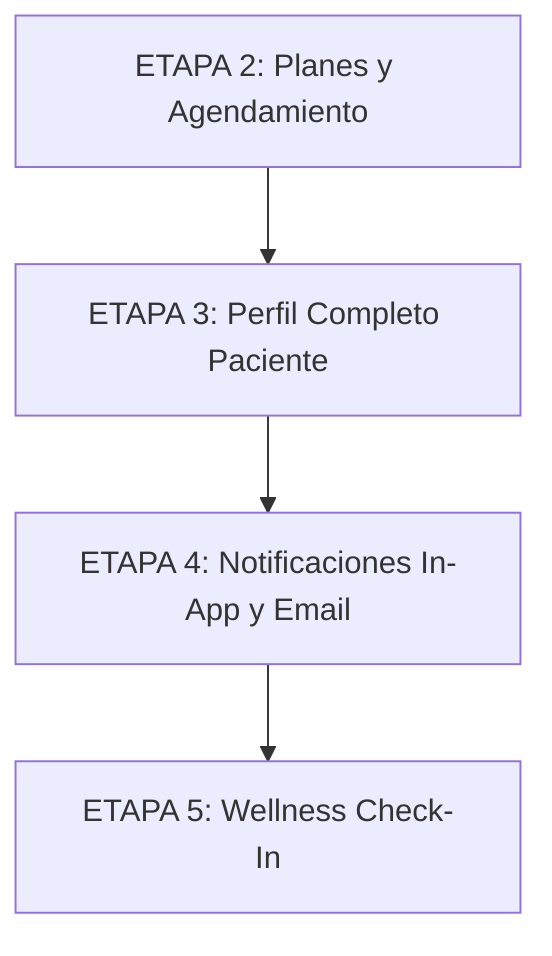

# Informe de Análisis de Brechas (Gap Analysis) — Prime F&H

**Fecha:** 18 de Julio de 2026  
**Objetivo:** Comparar el **MODELO DE NEGOCIO OBJETIVO** (definido en `CLAUDE.md`) contra el **CÓDIGO REAL** desplegado y en desarrollo, identificar inconsistencias, revisar modelos Mongoose y proponer la hoja de ruta ordenada sin conflictos de dependencias.

---

## 1. Evaluación de Reglas de Negocio (Existe / Parcial / No Existe)

### 1.1 Planes y Sesiones
| Regla de Negocio Objetivo | Estado | Detalle y Estado Real en Código |
|---|---|---|
| **Planes Entrenamiento:** 4, 8, 12 o 16 sesiones | **Parcial / Duplicado** | `ClientPlan.js` y `planCatalog.js` ya los tienen definidos. Sin embargo, `Plan.js` (el modelo viejo aún en uso activo) maneja `entrenamiento-2x` y `entrenamiento-3x`. |
| **Planes Kinesiología:** 5, 10 o 20 sesiones | **Parcial / Duplicado** | `ClientPlan.js` y `planCatalog.js` los incluyen (`[5, 10, 20]`). `Plan.js` solo soporta un bono fijo de 10 sesiones. |
| **Ciclo de 30 días desde fecha de pago** (no mes calendario) | **Parcial / Duplicado** | `ClientPlan.js` tiene la lógica `startDate + 30 días` y auto-expiración. Pero `appointmentController.js` sigue contando por mes calendario (`startOfMonth`/`endOfMonth`). |
| **Pago registrado manualmente por admin** | **Parcial** | `ClientPlan.js` exige el campo `registeredBy` (ObjectId del admin), pero `planController.js` actual usa `Plan.js` sin trazabilidad explícita de quién cobró. |
| **Sin precios en app + Botón WhatsApp al vencer** | **No Existe** | En backend no aplica precio, pero en la UI frontend falta el flujo y mensaje de vencimiento con botón a WhatsApp. |
| **Bloqueo de agendamiento al vencer plan (Día 31)** | **Existe** | `appointmentController.js` y `clientPlanService.js` bloquean reservas si el plan está vencido o no hay plan. |
| **Bloqueo de registro de datos de evolución al vencer plan** (solo lectura) | **No Existe** | `measurementController.js`, `exerciseController.js` y `evaController.js` NO verifican el estado del plan al crear o editar registros. |
| **Sesiones no usadas se pierden al vencer ciclo** | **Existe (en diseño)** | `ClientPlan.js` marca el plan como `expired` al pasar 30 días, perdiéndose el saldo pendiente. Falta conectar el agendamiento a esta colección. |
| **Profesional otorga sesiones extra con motivo** | **Parcial** | Existe el modelo `ExtraSession.js` con `patient`, `serviceType`, `grantedBy`, `reason`, `used`. FALTAN los endpoints en controllers y las vistas UI. |

---

### 1.2 Descuento de Sesiones
| Regla de Negocio Objetivo | Estado | Detalle y Estado Real en Código |
|---|---|---|
| **Descuento de 1 sesión:** completada (`completed`), no-show o cancelación `< 4h` | **Parcial** | Se descuenta sesión solo en kinesiología (`$inc: { sessionsUsed: 1 }` sobre `Plan.js`). Para entrenamiento no hay consumo de saldo por sesión, solo límite mensual de citas. |
| **No descuenta si cancela con `4+` horas de anticipación** | **Existe** | Implementado en `appointmentController.js` (devuelve el incremento o no descuenta). |

---

### 1.3 Agendamiento y Calendario
| Regla de Negocio Objetivo | Estado | Detalle y Estado Real en Código |
|---|---|---|
| **Paciente asignado a profesional fijo** (solo ve y agenda con él) | **Parcial** | `User.js` tiene `assignedProfessional`, pero es un `String` de texto libre y `appointmentController.js` no restringe la selección de profesional para pacientes. |
| **Duración de sesiones:** 60 minutos | **Existe** | `appointmentController.js` calcula automáticamente `endTime = startTime + 1h`. |
| **Slots inician cada 30 minutos** | **Existe** | Formato HH:MM soportado en backend y frontend. |
| **Máximo 4 pacientes SIMULTÁNEOS por profesional** | **Existe** | `countPatientsInSlot` en `appointmentController.js` valida solapamientos con `MAX_PATIENTS_PER_SLOT = 4`. |
| **Ventana de agendamiento:** Mínimo 4 horas de anticipación | **Conflicto** | `appointmentController.js` exige **24 horas** de anticipación (`PATIENT_BOOK_AHEAD_HOURS = 24`). |
| **No agendar sin sesiones disponibles o plan vencido** | **Existe** | Verificado en backend (`appointmentController.js`). |
| **Agenda recurrente** (múltiples citas de una vez, saltar llenos) | **No Existe** | No existe endpoint ni lógica batch de creación de citas recurrentes. |
| **Disponibilidad recurrente por día + bloqueos por fecha** | **Existe** | `Availability.js` y `availabilityController.js` funcionan correctamente. |
| **Admin agenda y cancela a nombre de cualquier paciente** | **Existe** | `isStaff` en `appointmentController.js` omite restricciones de tiempo y rol. |

---

### 1.4 Onboarding y Perfil del Paciente
| Regla de Negocio Objetivo | Estado | Detalle y Estado Real en Código |
|---|---|---|
| **Profesional crea paciente con info personal + historial** | **Existe** | `userController.js` / `authController.js` (`createPatient`). |
| **Paciente asignado automáticamente al profesional creador** | **Parcial** | Guarda el nombre/string en `assignedProfessional`, no una referencia `ObjectId`. |
| **Email de bienvenida con link para elegir contraseña** | **No Existe** | Falta el flujo de set-password por token enviado por email al crear paciente. |
| **Sección 1: Info Personal** | **Existe** | Nombre, email, teléfono, RUT, fecha nacimiento, dirección, estado. |
| **Sección 2: Historial Clínico** | **Parcial** | Existen la mayoría de campos en `User.js`. FALTAN: `height` (altura base), `weight` (peso base) y `isSmoker` (fuma sí/no). |
| **Sección 3: Archivos** (PDFs/Imágenes de exámenes) | **No Existe** | No existe modelo `ClientFile`, ni multer/storage, ni controller/rutas. |
| **Sección 4: Calendario** | **Existe** | Agendamiento y vista de citas. |
| **Sección 5: Evolución Corporal y Ejercicios** | **Existe** | `Measurement.js` (perímetros + peso) y `Exercise.js` (ejercicios + PRs + 1RM). |
| **Notificación al profesional si paciente modifica evolución** | **No Existe** | Sin avisos in-app ni email cuando el paciente registra datos. |
| **Wellness Check-In Diario** (5 sliders 1-5, alerta si `< 2.5`) | **No Existe** | No existe modelo `WellnessCheckIn`, controller, ni dashboard. |

---

## 2. Revisión Detallada de Modelos Mongoose

### 2.1 Modelos Existentes y Modificaciones Requeridas

#### `User.js`
- **[MODIFICAR]** `assignedProfessional`: Cambiar de `type: String` a `type: mongoose.Schema.Types.ObjectId`, `ref: 'User'`.
- **[NUEVO CAMPO]** `medicalInfo.height`: `Number` (altura base en cm).
- **[NUEVO CAMPO]** `medicalInfo.weight`: `Number` (peso base en kg).
- **[NUEVO CAMPO]** `medicalInfo.isSmoker`: `Boolean` (default: `false`).

#### `Appointment.js`
- **[NUEVO CAMPO]** `usedExtraSession`: `{ type: mongoose.Schema.Types.ObjectId, ref: 'ExtraSession' }` (para auditar si la cita consumió un cupo extra otorgado por el kinesiólogo).

#### `Availability.js`
- **Sin cambios requeridos**. Cumple con el diseño recurrente semanal y los bloqueos por fecha específica.

#### **DUALIDAD DE MODELOS DE PLANES:** `Plan.js` vs `ClientPlan.js`
- Actalmente existen dos modelos de plan en `backend/models`:
  1. `Plan.js`: Modelo obsoleto (`planType`: `kinesiologia`, `entrenamiento-2x`, `entrenamiento-3x`). Es el que **está conectado en `appointmentController.js`**.
  2. `ClientPlan.js`: Modelo correcto que cumple las reglas exactas (`serviceType`: `entrenamiento` \| `kinesiologia`, `sessionsTotal`: 4/8/12/16 o 5/10/20, ciclo 30 días, `registeredBy`).
- **Acción:** Desconectar y eliminar `Plan.js`. Refactorizar `appointmentController.js` y `planController.js` para usar exclusivamente `ClientPlan.js` y `clientPlanService.js`.

#### `Measurement.js` (Evolución Corporal)
- **[MODIFICAR]** `recordedBy`: Actualmente tiene `required: [true, 'El profesional es requerido']`. Debe ser opcional o aceptar al propio paciente cuando el paciente registre su evolución desde la PWA.

#### `Exercise.js` (`ExerciseProgress`)
- **[MODIFICAR]** `recordedBy`: Cambiar `required: true` para permitir que el `patient` sea el autor del registro.

#### `EVA.js` (Escala de Dolor)
- **[MODIFICAR]** `recordedBy`: Permitir que sea registrado por el paciente si aplica.

---

### 2.2 Modelos Nuevos a Crear

1. **`ClientFile.js`** (Sección de Archivos del Paciente)
   - `patient`: `ObjectId` (ref `User`, required)
   - `uploadedBy`: `ObjectId` (ref `User`, required)
   - `title`: `String` (required)
   - `fileUrl`: `String` (required)
   - `fileType`: `String` (enum: `['pdf', 'image', 'other']`)
   - `fileSize`: `Number`
   - `notes`: `String`
   - `timestamps`: true

2. **`Notification.js`** (Sistema de Notificaciones In-App)
   - `recipient`: `ObjectId` (ref `User`, required)
   - `sender`: `ObjectId` (ref `User`)
   - `type`: `String` (enum: `['evolution_updated', 'plan_expiring', 'plan_expired', 'appointment_scheduled', 'appointment_cancelled', 'wellness_alert']`)
   - `title`: `String` (required)
   - `message`: `String` (required)
   - `link`: `String` (ruta opcional para navegar en la app)
   - `read`: `Boolean` (default: `false`)
   - `timestamps`: true

3. **`WellnessCheckIn.js`** (Check-in Diario)
   - `patient`: `ObjectId` (ref `User`, required)
   - `date`: `Date` (required, normalizado a 00:00:00)
   - `sleep`: `Number` (min: 1, max: 5, required)
   - `energy`: `Number` (min: 1, max: 5, required)
   - `stress`: `Number` (min: 1, max: 5, required)
   - `muscleSoreness`: `Number` (min: 1, max: 5, required)
   - `mood`: `Number` (min: 1, max: 5, required)
   - `averageScore`: `Number` (calculado pre-save)
   - `notes`: `String`
   - `timestamps`: true
   - *Índice Único:* `{ patient: 1, date: 1 }` (garantiza 1 respuesta por día por paciente).

---

## 3. Análisis Profundo de Funcionamiento Actual vs Objetivo

### 3.1 Sistema de Planes y Suscripción
- **Hoy:** Dualidad no resuelta. `Plan.js` se usa en `appointmentController.js`. `ClientPlan.js` existe como borrador con `clientPlanService.js` pero no recibe llamadas de creación de citas ni cobros.
- **Objetivo:** Unificar en `ClientPlan.js`. El admin registra el pago asignando un `serviceType` (`entrenamiento` o `kinesiologia`) y un `sessionsTotal` de la lista permitida. El plan vence a los 30 días exactos (`startDate + 30d`).

### 3.2 Conteo de Sesiones
- **Hoy:** 
  - Kinesiología: Se descuenta una sesión por cita (`Plan.sessionsUsed + 1`).
  - Entrenamiento: No hay saldo de sesiones. Se cuenta el número de citas agendadas en el mes calendario actual (`countMonthlyAppointments`) y se compara contra 8 o 12.
- **Objetivo:** Todos los servicios (Entrenamiento y Kinesiología) tienen una bolsa fija de sesiones (4, 8, 12, 16 o 5, 10, 20). Cada cita agendada/completada descuenta 1 sesión del saldo de `ClientPlan` (o de `ExtraSession` si el saldo del plan llegó a 0).

### 3.3 Reglas de Cancelación
- **Hoy:**
  - El paciente solo puede cancelar con **al menos 4 horas** de anticipación (`PATIENT_CANCEL_AHEAD_HOURS = 4`). Si falta menos de 4 horas, el backend bloquea el intento.
  - Al cancelar a tiempo (`>= 4h`), se reintegra la sesión (para Kine).
- **Objetivo:** Mantener la regla de 4 horas. Si el paciente cancela con `< 4h`, la cita no se puede cancelar por el paciente o se marca como cancelada tardía consumiendo la sesión. Si cancela con `>= 4h`, la sesión regresa al saldo disponible del paciente y se libera el cupo.

### 3.4 Capacidad de Pacientes por Slot
- **Hoy:** Funciona **exactamente como pide el negocio**. `appointmentController.js` valida `MAX_PATIENTS_PER_SLOT = 4` contemplando solapamientos de bloques de 60 minutos. Ningún profesional puede tener más de 4 citas activas simultáneas en cualquier rango de tiempo.

---

## 4. Puntos de Conflicto en el Código Actual

Los siguientes archivos requieren modificaciones cuidadosas para no romper el sistema en producción:

1. **`backend/controllers/appointmentController.js`**:
   - *Línea 10:* `PATIENT_BOOK_AHEAD_HOURS = 24`. Debe cambiarse a `4`.
   - *Líneas 127-189:* Lógica de validación de plan. Importa `Plan.js` y calcula límites mensuales. Debe reemplazarse por `clientPlanService.getSessionBalance(patientId)`.
   - *Líneas 213-218 y 394-399:* `$inc: { sessionsUsed }` sobre `Plan.js`. Debe cambiarse por el consumo/devolución de saldo en `ClientPlan.js` o `ExtraSession.js`.

2. **`backend/routes/planRoutes.js` y `backend/controllers/planController.js`**:
   - Actualmente usan el CRUD de `Plan.js`. Deben actualizarse para gestionar `ClientPlan.js` (crear plan al registrar pago por admin, listar planes activos) y exponer endpoints para `ExtraSession.js`.

3. **`backend/controllers/userController.js` y `authController.js`**:
   - `assignedProfessional` se maneja como String. Debe convertirse a `ObjectId`. Se requiere cuidado si existen datos sembrados o usuarios de prueba con strings.

4. **Controllers de Evolución (`measurementController.js`, `exerciseController.js`, `evaController.js`)**:
   - Falta el middleware/validación de comprobación de plan activo. Si `clientPlanService.hasActivePlan(patientId)` es `false`, debe denegar la escritura (`POST`, `PUT`, `DELETE`) con HTTP 403.

---

## 5. Hoja de Ruta de Brechas por Etapas y Validación de Dependencias

### Orden de Etapas (según `STATUS.md`):

### 5.1 Desglose de Brechas por Etapa

#### **ETAPA 2 — PLANES Y AGENDAMIENTO**
1. Unificar modelos de planes: Desconectar `Plan.js` y activar `ClientPlan.js` + `planCatalog.js` + `clientPlanService.js`.
2. Habilitar registro de pagos por admin (`registeredBy`) en `planController.js`.
3. Conectar `appointmentController.js` a `ClientPlan.js` y `ExtraSession.js` para consumo/descuento unificado de sesiones.
4. Ajustar `PATIENT_BOOK_AHEAD_HOURS` de 24h a 4h en `appointmentController.js`.
5. Convertir `User.assignedProfessional` a referencia `ObjectId`.
6. Implementar endpoints para otorgar y listar `ExtraSession.js`.
7. Crear endpoint para agendamiento recurrente (lote de citas saltando slots llenos).

#### **ETAPA 3 — PERFIL COMPLETO DEL PACIENTE**
1. Agregar campos faltantes en `User.js` (`height`, `weight`, `isSmoker`).
2. Crear modelo `ClientFile.js` y endpoints para subida/descarga de archivos (PDFs/imágenes).
3. Modificar controllers de evolución (`measurementController`, `exerciseController`, `evaController`) para permitir `recordedBy` como paciente.
4. Aplicar bloqueo de **solo lectura** en evolución si `hasActivePlan()` es falso.
5. Enviar email de bienvenida al crear un nuevo paciente para que configure su contraseña.

#### **ETAPA 4 — NOTIFICACIONES**
1. Crear modelo `Notification.js` y controlador/rutas de notificaciones.
2. Agregar componente de campanita in-app con badge de no leídos.
3. Disparar notificaciones cuando:
   - El paciente registra o modifica evolución (hacia el `assignedProfessional`).
   - El plan está por vencer (5 días antes) o venció.
   - Cita agendada o cancelada.
4. Extender `emailService.js` con correos espejo para estos eventos.

#### **ETAPA 5 — WELLNESS CHECK-IN DIARIO**
1. Crear modelo `WellnessCheckIn.js` y controlador con validación de 1 respuesta diaria por paciente.
2. Implementar alerta automática a `assignedProfessional` (in-app y email) si el promedio diario `< 2.5`.
3. Crear dashboard de tendencias de Wellness para el profesional.

---

### 5.2 Análisis de Dependencias entre Etapas

- **¿Existe algún problema de dependencias con el orden propuesto?**
  **NO, el orden propuesto es estructuralmente correcto y libre de bloqueos circulares**, siempre que se respete el siguiente criterio:

  1. **Etapa 2 es el prerrequisito fundamental:**
     - La validación de "Evolución solo lectura" de la **Etapa 3** requiere que `ClientPlan.js` y `clientPlanService.hasActivePlan()` estén integrados en la **Etapa 2**.
     - Las alertas enviadas al profesional en la **Etapa 4** y **Etapa 5** requieren que `User.assignedProfessional` sea un `ObjectId` válido (realizado en la **Etapa 2**).
  2. **Etapa 4 (Notificaciones) sustenta a la Etapa 3 y 5:**
     - La "Notificación al profesional cuando el paciente modifica su evolución" (Etapa 3) se disparará en los controllers de evolución pero guardará registros en el modelo `Notification` de la Etapa 4. Esto no causa bloqueo si el modelo `Notification.js` se crea al inicio de la Etapa 4 o como transición al final de la Etapa 3.
  3. **Etapa 5 (Wellness) es autónoma:**
     - Se apoya en el modelo de usuarios y profesionales listo desde la Etapa 2 y el sistema de notificaciones listo desde la Etapa 4.

---
*Informe generado automáticamente para revisión del proyecto Prime-Saas.*
